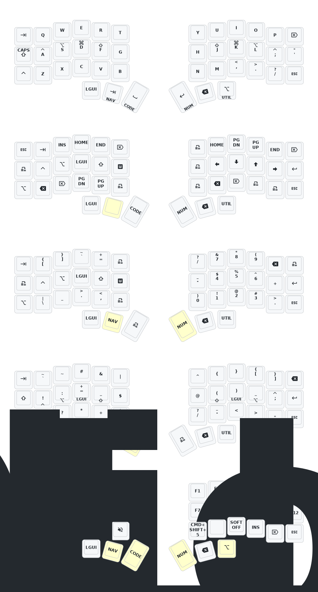

# Typeractive Corne ZMK Config

ZMK firmware config for the [Typeractive Corne](https://typeractive.xyz/pages/build) — a wireless split keyboard running on the nice!nano v2 with nice!view displays.

## Features

- 5-layer keymap with home-row mods
- nice!view gem custom status screen
- ZMK Studio support for real-time keymap updates
- Keymap diagram auto-generated on every push

## Setup

1. [Fork this repository](https://docs.github.com/en/get-started/quickstart/fork-a-repo#forking-a-repository).
2. [Enable the Actions tab](https://docs.github.com/en/actions/managing-workflow-runs-and-deployments/managing-workflow-runs/disabling-and-enabling-a-workflow#enabling-a-workflow) so the build and draw workflows can run.
3. Edit [`config/corne.keymap`](config/corne.keymap) to customize your layout.
4. Push — GitHub Actions will build the firmware and update the keymap diagram automatically.

Download the built `.uf2` files from the **Actions** tab, then flash each half by putting it into bootloader mode (double-tap reset).

## Keymap Diagram

<!-- auto-generated by keymap-drawer on push -->

## Layer Summary

| Layer | Name | Purpose |
|-------|------|---------|
| 0 | `BASE` | Normal typing, home-row mods, thumb access to other layers |
| 1 | `NAV` | Arrows, page movement, insert/delete |
| 2 | `NUM` | Right-hand numpad, brackets, modifiers on left home row |
| 3 | `CODE` | Coding symbols: brackets, operators, punctuation |
| 4 | `UTIL` | Bluetooth, RGB, output switching, function keys, bootloader |

## Home-Row Mods

The base layer uses home-row mods tuned for macOS (`CAGS` order):

| Key | Hold |
|-----|------|
| `A` | Control |
| `S` | Option |
| `D` | Command |
| `F` | Shift |
| `J` | Shift |
| `K` | Command |
| `L` | Option |
| `;` | Control |

Settings: balanced flavor, 240 ms tapping term, 175 ms quick-tap, 150 ms require-prior-idle.

## Thumb Cluster

| Position | Tap | Hold |
|----------|-----|------|
| Left outer | `GUI` | — |
| Left middle | `Tab` | `NAV` |
| Left inner | `Space` | `CODE` |
| Right inner | `Enter` | `NUM` |
| Right middle | `Backspace` | — |
| Right outer | `Option` | `UTIL` |

## UTIL Layer Reference

**Bluetooth:**
- `BT_CLR_ALL` — clear all stored profiles
- `BT_CLR` — clear current profile
- `BT_SEL 0–3` — switch to profile slot 0–3

**RGB:**
- `RGB_OFF` / `RGB_ON` — toggle underglow
- `RGB_EFF` / `RGB_EFR` — cycle effects
- `RGB_BRI` / `RGB_BRD` — adjust brightness

**Output & maintenance:**
- `OUT_USB` / `OUT_BLE` — force output mode
- `Studio Unlock` — unlock ZMK Studio
- `Bootloader` — enter flashing mode
- `Sys Reset` — reboot firmware
- `Soft Off` — deep sleep for transport; wake with physical reset button
- `macOS Screenshot` — sends `Command + Shift + 5`
- `F1–F12` — function keys

## macOS Modifier Reference

| ZMK | macOS |
|-----|-------|
| `GUI` | Command |
| `Alt` | Option |
| `Ctrl` | Control |
| `Shift` | Shift |

## Transport / Sleep

The `Soft Off` key (UTIL layer) puts the keyboard into deep sleep — it will not wake from keypresses. Press the physical reset button once to wake it. For long-term storage, use the physical power switches instead.
